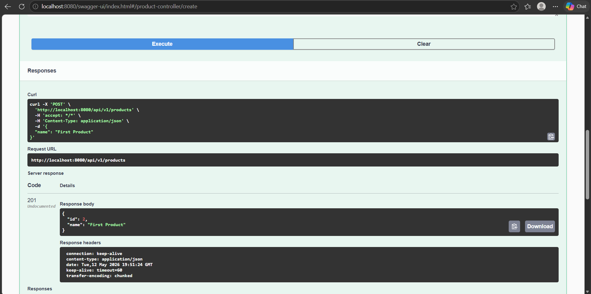
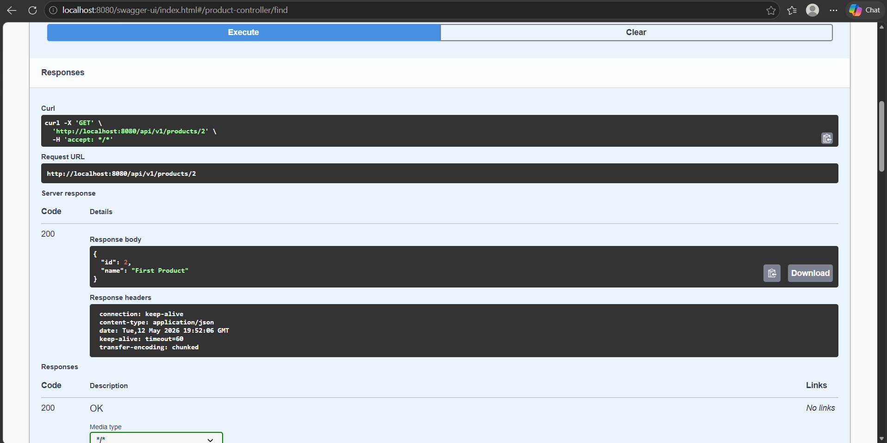
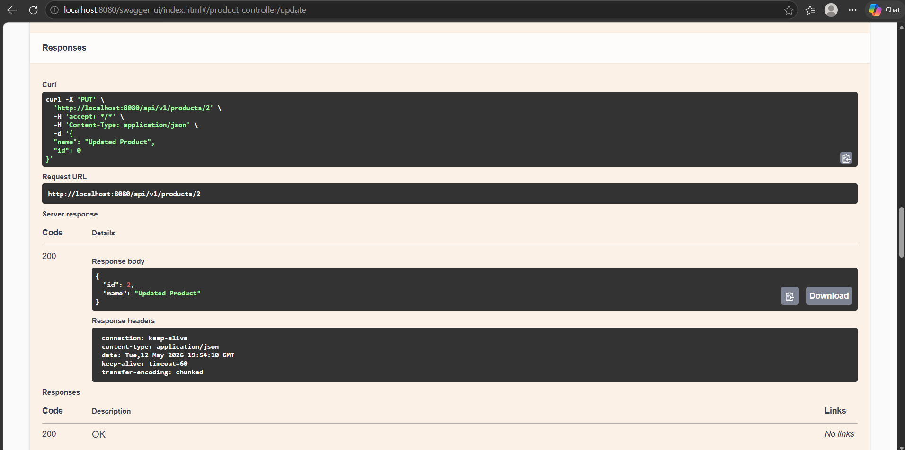
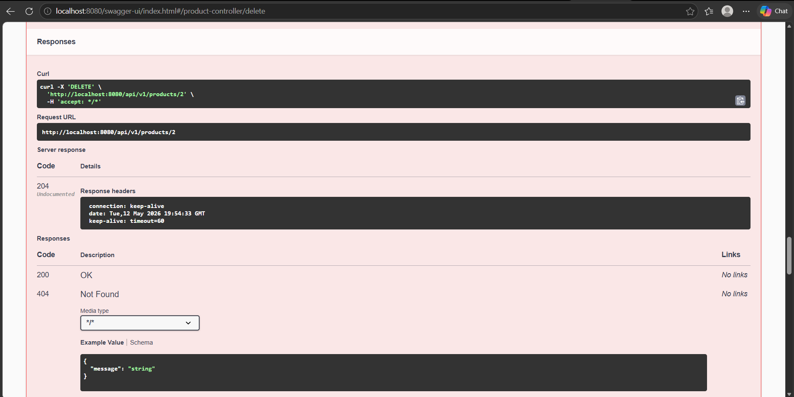
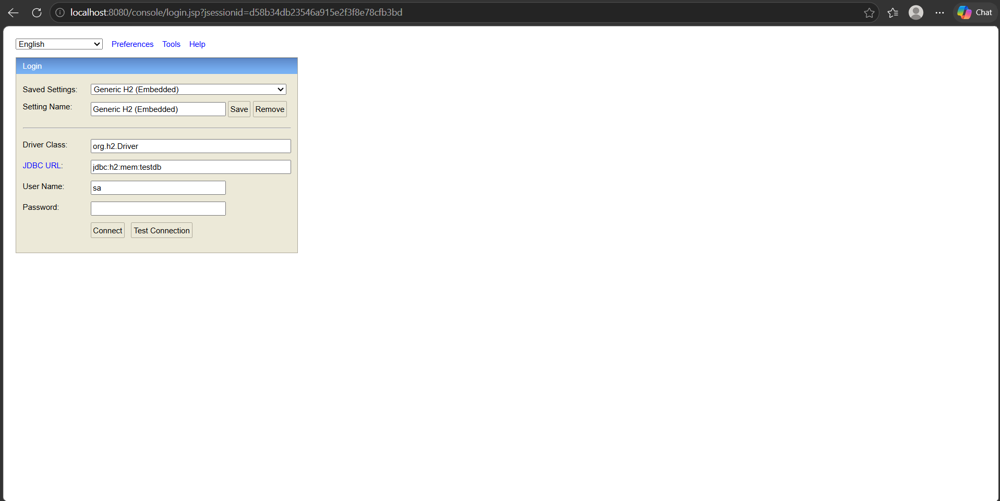

# Task 2 - First REST API Spring Project

## Description
This is the second Spring Boot project created as part of the Spring Framework Apps assignment at Akademia Finansów i Biznesu Vistula. The application is a fully functional REST API backend (no frontend) for managing products. It covers Spring stereotypes, HTTP methods (POST, GET, PUT, DELETE), Swagger UI documentation, exception handling, and database integration using Spring Data JPA with an H2 in-memory database.

---

## Technologies Used
- Java 17
- Spring Boot 3.2.0
- Maven
- Spring Web
- Spring Data JPA
- Hibernate
- H2 Database (in-memory)
- Springdoc OpenAPI (Swagger UI) 2.3.0
- Spring Boot DevTools

---

## Project Setup

### Step 1 - Create the project
Go to [https://start.spring.io/](https://start.spring.io/) or use IntelliJ Spring Initializr:

**File → New → Project → Spring Initializr**

- **Project:** Maven
- **Language:** Java
- **Spring Boot:** 3.2.0
- **Group:** `pl.edu.vistula`
- **Artifact:** `first-rest-api-spring`
- **Packaging:** Jar
- **Java:** 17

**Dependencies:**
- Spring Web
- Spring Data JPA
- H2 Database
- Spring Boot DevTools

### Step 2 - Add Swagger dependency to pom.xml
```xml
<dependency>
    <groupId>org.springdoc</groupId>
    <artifactId>springdoc-openapi-starter-webmvc-ui</artifactId>
    <version>2.3.0</version>
</dependency>
```

### Step 3 - Configure application.properties
```properties
spring.h2.console.enabled=true
spring.h2.console.path=/console
spring.datasource.url=jdbc:h2:mem:testdb
logging.level.org.hibernate.SQL=DEBUG
```

### Step 4 - Reload Maven and Run
Right-click project → **Maven** → **Reload Project**, then run the application.

---

## Project Structure

```
src/main/java/pl/edu/vistula/firstrestapispring/
│
├── product/
│   ├── api/
│   │   ├── request/
│   │   │   ├── ProductRequest.java
│   │   │   └── UpdateProductRequest.java
│   │   ├── response/
│   │   │   └── ProductResponse.java
│   │   └── ProductController.java
│   ├── domain/
│   │   └── Product.java
│   ├── repository/
│   │   └── ProductRepository.java
│   ├── service/
│   │   └── ProductService.java
│   └── support/
│       ├── exception/
│       │   └── ProductNotFoundException.java
│       ├── ProductExceptionAdvisor.java
│       ├── ProductExceptionSupplier.java
│       └── ProductMapper.java
│
├── shared/
│   └── api/
│       └── response/
│           └── ErrorMessageResponse.java
│
└── FirstRestApiSpringApplication.java
```

---

## Package Descriptions

- **api** — contains the `ProductController` which accepts HTTP requests and sends responses. Also contains `request` and `response` subpackages with classes used to read incoming JSON and write outgoing JSON.
- **domain** — contains the `Product` class which is the JPA entity mapped to the database table.
- **repository** — contains `ProductRepository` which extends `JpaRepository` and handles all database operations.
- **service** — contains `ProductService` which holds the business logic and connects the controller to the repository.
- **support** — contains helper classes: `ProductMapper` for mapping between objects, `ProductExceptionSupplier` and `ProductNotFoundException` for error handling, and `ProductExceptionAdvisor` for catching exceptions globally.
- **shared** — contains `ErrorMessageResponse` which is a shared response wrapper used across the application when returning error messages.

---

## Spring Stereotype Annotations Used

| Annotation | Class | Purpose |
|---|---|---|
| `@RestController` | ProductController | Handles HTTP requests, returns JSON responses |
| `@Service` | ProductService | Contains business logic |
| `@Repository` | ProductRepository | Handles database access |
| `@Component` | ProductMapper | General Spring-managed component |
| `@ControllerAdvice` | ProductExceptionAdvisor | Handles exceptions globally |

---

## API Endpoints

Base URL: `http://localhost:8080/api/v1/products`

### 1. Create a Product — POST

**URL:** `POST http://localhost:8080/api/v1/products`

**Request Body (JSON):**
```json
{
  "name": "First product"
}
```

**Response (201 Created):**
```json
{
  "id": 1,
  "name": "First product"
}
```

**Screenshot:**



---

### 2. Get a Product by ID — GET

**URL:** `GET http://localhost:8080/api/v1/products/1`

**Response (200 OK):**
```json
{
  "id": 1,
  "name": "First product"
}
```

**Screenshot:**



---

### 3. Update a Product — PUT

**URL:** `PUT http://localhost:8080/api/v1/products/1`

**Request Body (JSON):**
```json
{
  "name": "Updated product",
  "id": 1
}
```

**Response (200 OK):**
```json
{
  "id": 1,
  "name": "Updated product"
}
```

**Screenshot:**



---

### 4. Delete a Product — DELETE

**URL:** `DELETE http://localhost:8080/api/v1/products/1`

**Response:** `204 No Content` (empty body)

**Screenshot:**



---

---

## How to Test

### Using Swagger UI
1. Run the application
2. Open your browser and go to: `http://localhost:8080/swagger-ui/index.html`
3. You will see all endpoints listed under **product-controller**
4. Click on any endpoint → click **Try it out** → fill in the request body → click **Execute**

**Screenshot:**


---

### Using Postman
1. Download Postman from [https://www.postman.com/downloads/](https://www.postman.com/downloads/)
2. Open Postman and create a new request
3. Set the HTTP method (POST, GET, PUT, DELETE)
4. Enter the URL e.g. `http://localhost:8080/api/v1/products`
5. For POST and PUT requests: go to **Body** → select **raw** → select **JSON** → paste the JSON body
6. Click **Send**

---

### Using the H2 Database Console
1. Run the application
2. Go to: `http://localhost:8080/console`
3. Change the **JDBC URL** to: `jdbc:h2:mem:testdb`
4. Leave **User Name** as `sa` and **Password** empty
5. Click **Connect**
6. In the SQL editor run:
```sql
SELECT * FROM PRODUCTS;
```

**Screenshot:**




---

## Code Flow Explanation

When a POST request hits `http://localhost:8080/api/v1/products`:

1. **ProductController** receives the request. The `@RequestBody` annotation tells Spring to read the JSON body and convert it into a `ProductRequest` object automatically.
2. The controller calls `productService.create(productRequest)`.
3. **ProductService** calls `productMapper.toProduct(productRequest)` to convert the `ProductRequest` into a `Product` domain object.
4. The `Product` object is passed to `productRepository.save(product)`.
5. **ProductRepository** (which extends `JpaRepository`) saves the product to the H2 database and returns the saved entity with the generated ID.
6. **ProductService** calls `productMapper.toProductResponse(product)` to convert the saved `Product` into a `ProductResponse` object.
7. **ProductController** wraps the `ProductResponse` in a `ResponseEntity` with HTTP status `201 Created` and returns it.
8. Spring converts the `ProductResponse` object to JSON automatically and sends it back to the client.

---

## Why ProductRepository is Empty

`ProductRepository` extends `JpaRepository<Product, Long>`. Spring Data JPA automatically provides implementations of standard methods like `save()`, `findById()`, `findAll()`, and `deleteById()` at runtime. You do not need to write any code for these — Spring generates the implementation automatically based on the interface definition.

---

## Exception Handling Explanation

When a client requests a product with an ID that does not exist:

1. `productRepository.findById(id)` returns an empty `Optional`
2. `.orElseThrow(ProductExceptionSupplier.productNotFound(id))` throws `ProductNotFoundException`
3. `ProductExceptionAdvisor` (annotated with `@ControllerAdvice`) catches this exception globally
4. It returns an `ErrorMessageResponse` with the error message and HTTP status `404 Not Found`

This ensures the client always receives a clear, descriptive error instead of a generic `500 Internal Server Error`.
